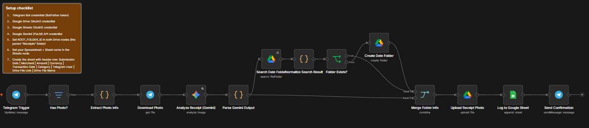

# Telegram Receipt Photo Processing (Gemini + Google Sheets + Drive)

An n8n workflow that turns a Telegram bot into a receipt inbox: send it a photo of a receipt, and it extracts the merchant, amount, currency, date, and category using Google Gemini, logs the data to a Google Sheet, archives the original photo to Google Drive organized by submission date, and replies with a confirmation summary.



## Demo Video

[Watch a walkthrough](https://drive.google.com/file/d/14qvdThDIGkt0EZc0hSdWMR4Z6lnOBLC9/view?usp=sharing)

## Try it live

Send a receipt photo to [@ReceiptsPro123Bot](https://t.me/ReceiptsPro123Bot) on Telegram to see it in action.

## Live Examples

- 📊 [View the Google Sheet](https://docs.google.com/spreadsheets/d/12gP70Cc37ZXwaux-vqbDg2Ym4784hYFQBNru30aZgeg/edit?usp=sharing)
- 📁 [View the Drive folder](https://drive.google.com/drive/u/0/folders/1W9wSdmB7QOzi1VKiU-xEHHsTaFwzBhu7)

## What it does

- **Accepts receipt photos sent via Telegram** to a bot, ignoring any non-photo messages
- **Extracts structured data with Google Gemini** (merchant name, total amount, currency, transaction date, category) as strict JSON from the receipt image
- **Logs the extracted data to a Google Sheet**, alongside the sender's Telegram username and a link to the archived Drive file
- **Saves the original photo to Google Drive**, named with the merchant, date, and Telegram message ID for easy identification
- **Groups photos into folders by submission date**, creating a new dated folder on demand or reusing an existing one
- **Replies in Telegram** with a confirmation message summarizing what was extracted

## Example output structure

```
Google Drive Root/
└── 2026-09-06/
    └── Starbucks_2026-09-06_48213.jpg
```

## How it works

1. **Telegram Trigger** — listens for incoming messages
2. **Has Photo?** — filters out anything that isn't a photo message
3. **Extract Photo Info** — pulls the highest-resolution photo, sender, message ID, and formats the submission date
4. **Download Photo** — fetches the actual image binary from Telegram
5. **Analyze Receipt (Gemini)** — sends the image to Gemini with a prompt constraining the response to a strict JSON schema
6. **Parse Gemini Output** — cleans and parses Gemini's response into structured fields, merging it back with the sender/date info from step 3
7. **Folder resolution** (`Search Date Folder` → `Normalize Search Result` → `Folder Exists?` → `Create Date Folder` if needed) — finds or creates the folder for that day
8. **Merge Folder Info** — combines the resolved folder ID with the parsed receipt data
9. **Upload Receipt Photo** — uploads the image into the correct dated folder with a descriptive filename
10. **Log to Google Sheet** — appends a row with all extracted fields and the Drive file link
11. **Send Confirmation** — replies to the user in Telegram with a summary of what was extracted

### Design notes

- Telegram returns each photo in multiple resolutions, smallest first — the workflow always takes the last (largest) one
- Gemini's response shape can vary depending on how the node wraps it, and sometimes includes markdown code fences around the JSON — the parsing step normalizes both before attempting to parse
- The Gemini node consumes the image binary for its API call but doesn't forward it downstream, so the original binary is re-pulled directly from the **Download Photo** node's output rather than assumed to survive the chain
- A Google Drive folder search returns zero items when the folder doesn't exist yet, which can otherwise cause the workflow to silently stop; a normalization step guarantees exactly one item is always passed to the exists/create branch
- Sheet logging and photo upload both depend on the same resolved folder ID and parsed data, joined via a position-based Merge rather than being recomputed independently

## Tech stack

- [n8n](https://n8n.io/) (workflow automation)
- Telegram Bot API
- Google Gemini (vision/multimodal)
- Google Drive API
- Google Sheets API

## Setup

1. Import the workflow JSON into your n8n instance
2. Create a Telegram bot via [BotFather](https://t.me/BotFather) and connect its API token as a credential
3. Connect your Google Drive, Google Sheets, and Google Gemini (PaLM) API credentials
4. Set the root Google Drive folder ID (the parent "Receipts" folder) in the **Search Date Folder** and **Create Date Folder** nodes
5. Set your target Spreadsheet and sheet name in the **Log to Google Sheet** node
6. Create the sheet with this header row: `Submission Date | Merchant | Amount | Currency | Transaction Date | Category | Telegram User | Drive File Link`
7. Activate the workflow and send a receipt photo to your bot to test

## License

MIT
